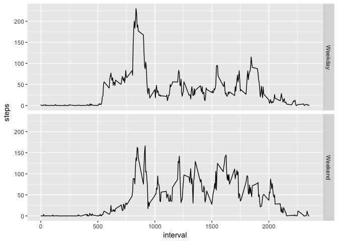

## Loading and preprocessing the data
We read in the data and convert the date column to date.

```r
library(ggplot2)
library(dplyr)
unzip("activity.zip")
activityDf = read.csv("activity.csv")
activityDf$date = as.Date(activityDf$date)
```

## What is mean total number of steps taken per day?
Here is a histogram of the total steps taken per day:


```r
makeMeanStepsPerDayDf = function (df) {
    stepsPerDayTable = tapply(df$steps, INDEX = df$date, sum, na.rm=TRUE)
    stepsPerDayDf = as.data.frame(stepsPerDayTable)
    stepsPerDayDf$date = as.Date(row.names(stepsPerDayDf))
    colnames(stepsPerDayDf) = c("steps", "date")
    stepsPerDayDf = stepsPerDayDf[!is.na(stepsPerDayDf$steps),]
    stepsPerDayDf$steps = as.numeric(stepsPerDayDf$steps)
    stepsPerDayDf
}
stepsPerDayDf = makeMeanStepsPerDayDf(activityDf)
hist(x=stepsPerDayDf$steps, main="Histogram of Steps per Day", xlab="Steps per day")
```

<!-- -->
 
 The mean total number of steps taken per day:

```r
mean(stepsPerDayDf$steps)
```

```
## [1] 9354.23
```

```r
median(stepsPerDayDf$steps)
```

```
## [1] 10395
```


## What is the average daily activity pattern?
Line chart of the steps per interval averaged across days


```r
stepsPerIntervalTable = tapply(activityDf$steps, INDEX = activityDf$interval, mean, na.rm=TRUE)
stepsPerIntervalDf = data.frame(steps=unname(stepsPerIntervalTable), interval=names(stepsPerIntervalTable))
stepsPerIntervalDf$interval = sort(as.numeric(levels(stepsPerIntervalDf$interval)))
plot(x=stepsPerIntervalDf$interval, y=stepsPerIntervalDf$steps, type="n", xlab="Interval", ylab="Steps",
     main="Interval Steps Average Across Days")
lines(x=stepsPerIntervalDf$interval, y=stepsPerIntervalDf$steps, type="l")
```

<!-- -->

The interval with the max number of steps:

```r
# Interval with max steps
stepsPerIntervalDf[which.max(stepsPerIntervalDf$steps),]
```

```
##        steps interval
## 104 206.1698      835
```

## Imputing missing values
Total number of NAs

```r
# Total num of NAs
sum(is.na(activityDf$steps))
```

```
## [1] 2304
```

Impute NAs with the interval mean.  We do this because the values can vary quite a bit for each day but are fairly consistent for the same interval.

```r
# Impute w/ mean for interval
activityDfWithAverage = merge(x=activityDf, y=stepsPerIntervalDf, by="interval", all.x=TRUE)
activityDfWithAverage$steps.x[is.na(activityDfWithAverage$steps.x)] = activityDfWithAverage[is.na(activityDfWithAverage$steps.x),4]
activityDfWithAverage$steps.y = NULL
activityDfWithAverage = arrange(activityDfWithAverage, date, interval)
colnames(activityDfWithAverage)[2] = "steps"

stepsPerDayImputedDf = makeMeanStepsPerDayDf(activityDfWithAverage)
hist(x=stepsPerDayImputedDf$steps, main="Histogram of Imputed Steps per Day", xlab="Steps per day")
```

<!-- -->

There is a large difference in the mean with imputed values and somewhat large difference in the median.

```r
mean(stepsPerDayImputedDf$steps)
```

```
## [1] 10766.19
```

```r
median(stepsPerDayImputedDf$steps)
```

```
## [1] 10766.19
```

```r
mean(stepsPerDayImputedDf$steps) - mean(stepsPerDayDf$steps)
```

```
## [1] 1411.959
```

```r
median(stepsPerDayImputedDf$steps) - median(stepsPerDayDf$steps)
```

```
## [1] 371.1887
```
## Are there differences in activity patterns between weekdays and weekends?
There are a smaller average number of steps on the weekends.

```r
isWeekend = weekdays(activityDfWithAverage$date) %in% c("Saturday", "Sunday")
activityDfWithAverage$dayType = "Weekday"
activityDfWithAverage[isWeekend,4] = "Weekend"
activityDfWithAverage$dayType = as.factor(activityDfWithAverage$dayType)
activityDfAvgInterval = aggregate(steps ~ interval + dayType, data=activityDfWithAverage, mean)
g = ggplot(activityDfAvgInterval, aes(interval, steps, group=dayType))
g + geom_line() + facet_grid(dayType ~ .)
```

<!-- -->
